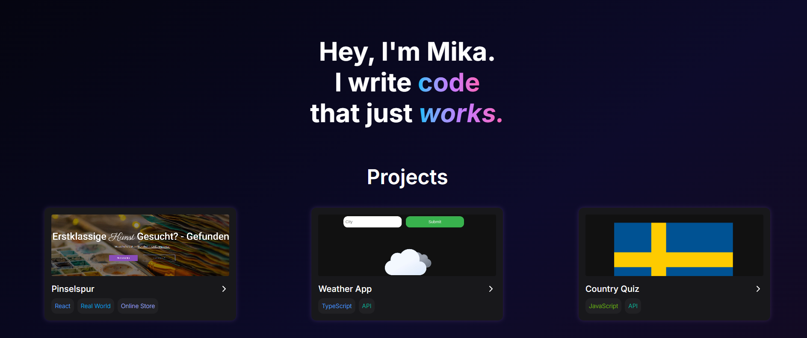

# funcnroll.dev – Developer Portfolio



## Overview

funcnroll.dev is a fast, minimalist developer portfolio built with modern front-end tools. It showcases personal projects, key skills, and contact information using a modular, component-based approach.

## Features

- Built with React and Vite for performance and speed
- Responsive design, optimised for all screen sizes
- Reusable UI components to keep the codebase DRY
- Syntax-highlighted code samples using Shiki
- Deployed with Nginx on a Debian VPS
- No tracking or analytics – fully GDPR-compliant
- Includes favicon, webmanifest, `robots.txt`, and `sitemap.xml` for SEO

## Stack

- React 19
- Vite
- TailwindCSS
- React Router
- Shiki (code highlighting)
- Lucide-react (icons)
- Nginx (server deployment)
- Bunny Fonts (GDPR-compliant)

## Getting Started

1. **Clone the repository:**

   ```bash
   git clone https://github.com/funcnroll/funcnroll.dev
   ```

2. **Install Dependencies:**

   ```bash
   npm install
   ```

3. **Build and Run:**

   ```bash
   npm run dev
   ```

## License

This project is licensed under the [MIT License](LICENSE.txt).
